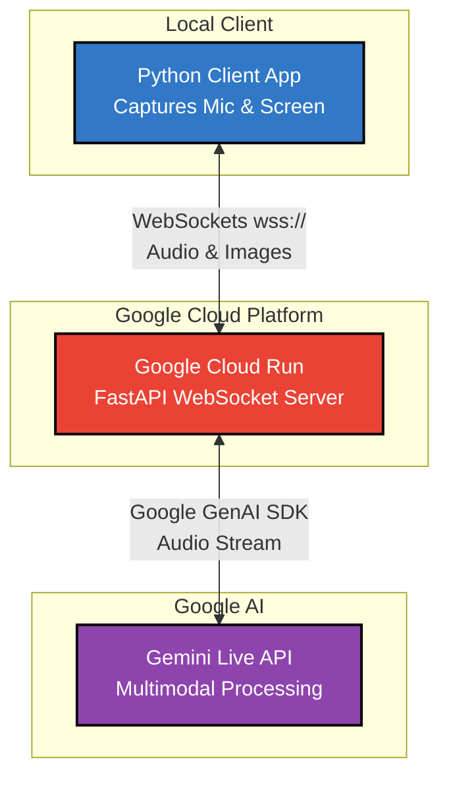

# Interview Helper:
**Interview Helper** is an immersive multimodal mock interview agent designed for software engineers. This was my project built for the Gemini Live Agent Challenge.

## Architectural Diagram:
The system uses a high-speed bidirectional streaming architecture to minimize latency and provide a "live" feel.

## Setup Instructions:
### Prerequisites: Python 3.10+, Google Cloud account, Gemini API Key
Backend: 1) go to backend directory: cd backend
         2) pip install -r requirements.txt
         3) Set up your environment variables in a .env file:
             GOOGLE_API_KEY=your_api_key_here
         4) Run: uvicorn main:app

Client: 1) go to client directory: cd client
        2) pip install -r requirements.txt
        3) Update the url in client.py to point to your backend on line 84
        3) Run: python client.py

## How To Test:
1) The Agent will greet you and present a problem after you run python client.py
2) Explain your approach and you can whiteboard your approach using Paint or another drawing tool and the agent will listen and acknowledge your approach
3) Open your favorite IDE and start coding

## Built With:
Gemini 2.5 Flash Live API
Google Cloud Run
FastAPI
Python
OpenCV/MSS
